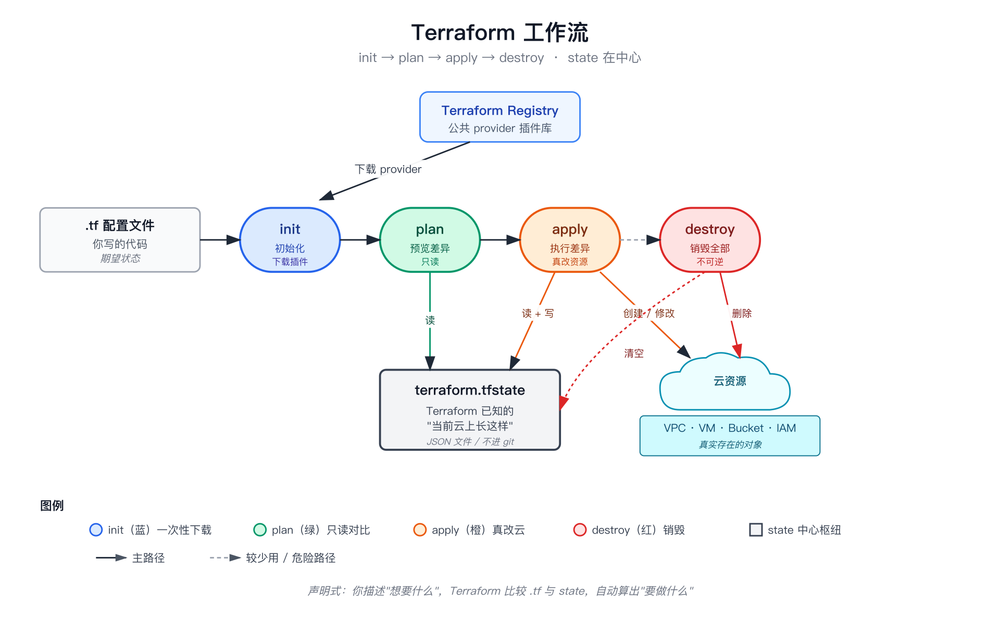

# 第 03 章：Terraform 工作流

> 上一章：[02 — HCL 语法](02-hcl-syntax.html) · [章节索引](./)

四个动词 + 一个文件。会了这五样，你就理解了 Terraform 的全部"操作语义"。


*图：Terraform 工作流：4 个动词围绕中心 state 文件运转*

## 1. 四个核心动词

```bash
terraform init       # 第一次跑：下载 provider 插件
terraform plan       # 看一眼：现在 vs 想要的差异
terraform apply      # 执行：把差异落地
terraform destroy    # 拆除：把所有资源删了
```

| 动词 | 干啥 | 何时跑 | 危险度 |
|---|---|---|---|
| `init` | 下载 provider 二进制（如 `hashicorp/google`）到 `.terraform/`；初始化 backend | 第一次 / 添加新 provider / 升级 provider | 🟢 安全 |
| `plan` | 对比 state 跟 .tf 文件，**只读**模式列出会做什么 | 改完文件想验证 | 🟢 安全 |
| `apply` | 真做 plan 列出的事 — **创建/修改/删除真实资源** | review 完 plan 满意 | 🔴 不可逆（部分资源） |
| `destroy` | 把当前 state 里所有资源删了 | sandbox 环境清理 | 🔴 危险 |

### 标准工作流

```bash
# 1. 第一次或刚改了 provider
terraform init

# 2. 改了 .tf 文件，先看 diff
terraform plan

# 3. 看清楚了再执行
terraform apply
# 弹出 "Do you want to perform these actions?" — 输入 yes

# 4. 想拆掉重建
terraform destroy
```

### 几个常用辅助命令

```bash
terraform fmt              # 格式化所有 .tf 文件（缩进、对齐）
terraform validate         # 静态语法检查（不连云）
terraform output           # 打印 outputs.tf 里定义的输出值
terraform output cluster_endpoint    # 只打某一个

terraform state list                 # 列出 state 里的所有资源
terraform state show <addr>          # 看某个资源的当前状态
```

## 2. State —— Terraform 怎么知道"现在云上有啥"

Terraform 在本地维护一个文件叫 `terraform.tfstate`（JSON 格式），里面记录："上次 apply 之后，云上长这个样子"。

```
        你的 .tf 文件                 terraform.tfstate           真实云上
   "我想要 VPC name=foo"      ↔    "VPC name=foo, id=net-123"    ↔   id=net-123
   "我想要 cluster name=bar"  ↔    "cluster bar, id=clu-456"     ↔   id=clu-456
       (期望状态)                   (Terraform 已知状态)             (实际状态)
```

`terraform plan` 做的事，简化版：

1. 读 `terraform.tfstate`（已知状态）
2. 跟 `.tf` 文件对比（期望状态）
3. 跑 API 询问云："你那边这个资源是这样的吗？"（实际状态）
4. 三方一致 → 啥都不做
5. 不一致 → 列出 plan：哪些要改

### State 的几个常识

- **state 文件包含敏感信息**（API key 名、IP、有时甚至明文密码），**不要 git commit**
- **多人协作要用远程 state**（如 GCS bucket、S3、Terraform Cloud），不能各自一份本地 state，否则会覆盖彼此的改动
- **一旦云上资源被你手工删除**（绕过 Terraform），state 就跟实际不一致 —— 下次 plan 会很奇怪（"想创建一个已经存在的资源"）
- **state 一旦丢了**，Terraform 就完全失忆，需要 `terraform import` 一个一个把云上资源认领回来（耗时、易错）

### 远程 state 长啥样

本教程的项目目前是本地 state（因为只有少数操作员）。生产环境应该改成：

```hcl
# main.tf
terraform {
  backend "gcs" {
    bucket = "my-cloud-project-terraform-state"
    prefix = "gke-infra/"
  }
}
```

或者 AWS S3：

```hcl
terraform {
  backend "s3" {
    bucket = "my-terraform-state"
    key    = "gke-infra/terraform.tfstate"
    region = "us-east-1"
  }
}
```

切到远程 state 后：

- 多人 `terraform apply` 不会互相覆盖（backend 自动加锁）
- 误删本地 `.terraform/` 不会丢真相
- CI 跑 plan/apply 跟本地用的是同一份 state

**远程 state 是生产化的最低门槛之一**。

## 3. 项目里 state 文件长哪

本教程参考的真实项目布局：

```
cloud/deployments/stacks/gke/infra/
├── terraform.tfstate          ← state（gitignored）
├── terraform.tfstate.backup   ← 上次 apply 前的快照
├── *.tf                        ← 我们写的代码（git checked in）
├── terraform.tfvars            ← 操作员自定义变量（gitignored — 因为可能含敏感值）
└── terraform.tfvars.example    ← 示例 / 模板（git checked in）
```

`terraform.tfstate` **不会进 git** —— 它跟着本机走。`*.tf` 进 git，是大家共享的源码。

`terraform.tfvars` 是单独一个文件，写本地特定的变量值（如管理员 IP、本地项目 ID）；`terraform.tfvars.example` 是它的"模板"，告诉新人"该填哪些字段、格式啥样"。

## 4. plan 输出怎么读

`terraform plan` 输出的核心是 diff。看几个例子：

### 创建（绿 +）

```diff
+ resource "google_storage_bucket" "audit" {
+   name     = "my-cloud-project-audit"
+   location = "EU"
+   storage_class = "STANDARD"
+ }
```

加号 = 全新创建。安全。

### 修改 in-place（黄 ~）

```diff
~ resource "google_storage_bucket" "audit" {
~   storage_class: "STANDARD" → "NEARLINE"
}
```

波浪号 = 在原资源上改某个字段。一般安全 —— 但要看是哪个字段。

### 销毁重建（红色 -/+）

```diff
- resource "google_compute_network" "gke" {
+   name: "my-cluster-vpc" → "my-test-vpc"  # forces replacement
}
```

`forces replacement` = **先删再建**。意味着：

- 资源会**完全销毁**一段时间
- 关联的资源（如挂在这个 VPC 上的子网）**也会跟着销毁**
- 如果是有数据的资源（数据库、bucket 内容），数据会**丢失**

**永远在 apply 前看清楚 forces replacement 标记**。

### 删除（红 -）

```diff
- resource "google_compute_network" "old_vpc" {
-   name = "old-vpc"
}
```

减号 = 销毁。如果是你没想删的资源出现了减号，说明你的 `.tf` 文件被错误编辑或者 state 漂移了 —— 立刻按 ctrl+C 别按 yes。

### 末尾的 summary

```
Plan: 12 to add, 3 to change, 2 to destroy.
```

一句话告诉你 plan 的总规模。生产环境 destroy 数 > 0 一定要警觉。

## 5. apply 的两阶段

`terraform apply` 实际上是两步：

```bash
# 不带 plan 文件：apply 内部自己跑一次 plan，再让你确认
terraform apply

# 带 plan 文件：plan 一次保存下来，apply 时直接执行（CI 流水线常用）
terraform plan -out=tfplan
terraform apply tfplan
```

第二种方式好处：plan 文件可以传到 PR、加签发 / approve 流程，apply 时绝对执行的就是 reviewer 看过的那个 plan，不会临时偏移。

## 6. 一个常见教训：手动改了云上资源

操作员 A 用 Terraform 创了个 bucket。操作员 B 嫌 bucket 标签不对，**直接在 GCP Console 里改了标签**。下次 A 跑 `terraform plan`：

```diff
~ resource "google_storage_bucket" "audit" {
~   labels: { team = "data" } → { team = "engineering" }
}
```

Terraform 看到云上和 .tf 不一致，**默认会想把它改回 .tf 描述的样子**。如果 A 没注意 plan，按了 yes —— B 的改动就被回滚了。

**规矩**：云上资源被 Terraform 管的时候，永远不要在 Console 里手工改。要改就去改 `.tf` 文件 + git commit + plan + apply。

## 7. 学完这一章应该会什么

- ✅ 知道 init / plan / apply / destroy 各自干什么、何时用
- ✅ 知道 state 是 Terraform 的核心 —— 不是 `.tf` 文件
- ✅ 看 plan 输出能分辨创建 / in-place / 重建 / 销毁四种动作
- ✅ 知道为什么生产化要用远程 state
- ✅ 准备好下一章看真实 GKE 代码

下一章开始就是逐字解读真实 `.tf` 文件了。

---

> 下一章：[04 — GKE Provider 与 Variables](04-gke-provider-variables.html) · [章节索引](./)
