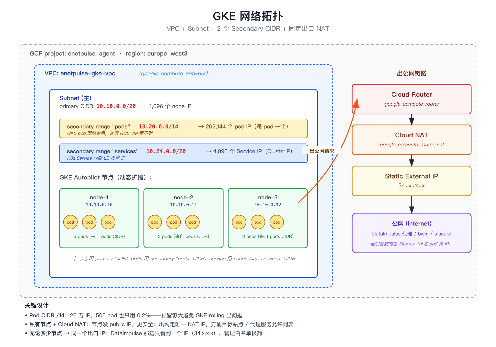

# 第 05 章：GKE — 网络（network.tf）

> 上一章：[04 — Provider 与 Variables](04-gke-provider-variables.html) · [章节索引](./)

集群没有 VPC 跑不起来 —— 所有 Autopilot node 必须在某个 VPC 里。这一章解读 `network.tf`：VPC + subnet + NAT 三件套。


*图：GKE 网络拓扑：VPC + 主子网 + 2 个 secondary CIDR + 唯一出口 NAT IP*

## 1. network.tf 全文

```hcl
resource "google_compute_network" "gke" {
  name                    = "${var.cluster_name}-vpc"
  auto_create_subnetworks = false
}

resource "google_compute_subnetwork" "gke" {
  name          = "${var.cluster_name}-subnet"
  ip_cidr_range = "10.10.0.0/20"
  region        = var.region
  network       = google_compute_network.gke.id

  secondary_ip_range {
    range_name    = "pods"
    ip_cidr_range = "10.20.0.0/14"
  }
  secondary_ip_range {
    range_name    = "services"
    ip_cidr_range = "10.24.0.0/20"
  }

  private_ip_google_access = true
}

resource "google_compute_address" "nat" {
  name   = "${var.cluster_name}-nat"
  region = var.region
}

resource "google_compute_router" "nat" {
  name    = "${var.cluster_name}-nat-router"
  network = google_compute_network.gke.id
  region  = var.region
}

resource "google_compute_router_nat" "nat" {
  name                               = "${var.cluster_name}-nat"
  router                             = google_compute_router.nat.name
  region                             = var.region
  nat_ip_allocate_option             = "MANUAL_ONLY"
  nat_ips                            = [google_compute_address.nat.self_link]
  source_subnetwork_ip_ranges_to_nat = "ALL_SUBNETWORKS_ALL_IP_RANGES"

  log_config {
    enable = true
    filter = "ERRORS_ONLY"
  }
}
```

5 个 resource。我们一个一个看。

## 2. VPC（虚拟私有网络）

```hcl
resource "google_compute_network" "gke" {
  name                    = "${var.cluster_name}-vpc"
  auto_create_subnetworks = false
}
```

- `resource` 块声明"我要创建一个 VPC"
- 第一个 label `google_compute_network` = 资源**类型**（由 google provider 提供）
- 第二个 label `gke` = 资源**本地名字**（你自己起的，仅 Terraform 内部引用用）
- `name = "${var.cluster_name}-vpc"` = VPC 在 GCP 上**实际显示**的名字（如 `my-cluster-vpc`）
- `auto_create_subnetworks = false` = 关闭"自动建子网" —— 我们手工指定

> **本地名字 vs 实际名字**：`gke` 是写代码引用时用的（如 `google_compute_network.gke.id`）；`my-cluster-vpc` 是 GCP 真给的名字。两者**不需要一样**。

## 3. Subnet（子网）

```hcl
resource "google_compute_subnetwork" "gke" {
  name          = "${var.cluster_name}-subnet"
  ip_cidr_range = "10.10.0.0/20"
  region        = var.region
  network       = google_compute_network.gke.id
```

- `name` —— 实际名字
- `ip_cidr_range = "10.10.0.0/20"` —— node 用的 CIDR，4096 个 IP
- `region = var.region` —— 哪个区域
- `network = google_compute_network.gke.id` —— 引用上面那个 VPC，让 Terraform 知道这个 subnet 属于哪个 VPC（同时建立**依赖关系**：先建 VPC 再建 subnet）

### 3.1 GKE 特殊：两个 secondary_ip_range

```hcl
  secondary_ip_range {
    range_name    = "pods"
    ip_cidr_range = "10.20.0.0/14"
  }
  secondary_ip_range {
    range_name    = "services"
    ip_cidr_range = "10.24.0.0/20"
  }
```

GKE 需要两个**次要 IP 段** —— pod 网络（每个 pod 一个 IP）和 service 网络。这是 GKE 特殊要求，普通 GCE VM 用不到。

- `pods` 给 `/14`（262,144 IP）—— 一个 pod 一个 IP，500 pod 是九牛一毛
- `services` 给 `/20`（4,096 IP）—— 一个 service 一个 IP

> **CIDR 不能重叠**：`10.10.0.0/20`（node）、`10.20.0.0/14`（pods）、`10.24.0.0/20`（services）这三个段不能跟彼此重叠，也不能跟你公司其他 VPC 重叠。`/14` 是个**很大的段**（17 万 IP），所以放在 `10.20.0.0` 而不是 `10.0.0.0`，给上下文留空间。

### 3.2 私有节点访问 Google API

```hcl
  private_ip_google_access = true
}
```

让私有节点能访问 Google API（如 GCS、AR），即使没有 public IP。

**Autopilot 私有节点的必需配置** —— 否则 pod 拉镜像、写 GCS 都会失败。

## 4. NAT 三件套

GCP 上要让无 public IP 的节点访问公网（外部站点、第三方 API、镜像仓库），需要 **NAT 网关**。NAT 在 GCP 上拆成 3 个资源：

1. 静态外部 IP
2. Router
3. NAT 配置

### 4.1 静态外部 IP

```hcl
resource "google_compute_address" "nat" {
  name   = "${var.cluster_name}-nat"
  region = var.region
}
```

预留一个**静态外部 IP** —— 给 NAT 网关用。这就是项目的 "NAT egress IP" —— **所有 pod 出公网都从这一个 IP 出**。

代理服务（DataImpulse、Bright Data 等）可以把这个 IP 加白名单。

### 4.2 Router

```hcl
resource "google_compute_router" "nat" {
  name    = "${var.cluster_name}-nat-router"
  network = google_compute_network.gke.id
  region  = var.region
}
```

GCP 上 NAT 必须挂在一个 Router 上。Router 本身不做啥事 —— 只是 NAT / VPN 的载体。

### 4.3 NAT 配置

```hcl
resource "google_compute_router_nat" "nat" {
  name                               = "${var.cluster_name}-nat"
  router                             = google_compute_router.nat.name
  region                             = var.region
  nat_ip_allocate_option             = "MANUAL_ONLY"
  nat_ips                            = [google_compute_address.nat.self_link]
  source_subnetwork_ip_ranges_to_nat = "ALL_SUBNETWORKS_ALL_IP_RANGES"

  log_config {
    enable = true
    filter = "ERRORS_ONLY"
  }
}
```

- `router` —— 挂在上面那个 router 上
- `nat_ip_allocate_option = "MANUAL_ONLY"` —— 不要 GCP 自动分配，用我们指定的 IP
- `nat_ips = [...]` —— 只用我们这一个静态 IP
- `source_subnetwork_ip_ranges_to_nat = "ALL_SUBNETWORKS_ALL_IP_RANGES"` —— 整个 VPC 都通过这个 NAT 出公网
- `log_config` —— 打开 NAT 错误日志，方便日后调试连接问题

## 5. 资源依赖关系（Terraform 自动推断）

Terraform 自动从代码里**推断依赖顺序**：

```
google_compute_network.gke   (VPC)
    ↓ 被 .id 引用 ↓
google_compute_subnetwork.gke   (subnet 依赖 VPC)
    ↓
google_compute_router.nat   (router 依赖 VPC)
    ↓ 被 .name 引用 ↓
google_compute_router_nat.nat   (NAT 依赖 router + IP)
    ↑
google_compute_address.nat   (NAT 依赖 IP)
```

`terraform apply` 会按拓扑顺序建：先 VPC + IP，再 subnet + router，最后 NAT。**你不需要手工写顺序** —— 它从 `.id`、`.name`、`.self_link` 这种引用自动推。

> 这是声明式的另一个好处：你只描述"谁引用谁"，工具自己算执行顺序。命令式（如 bash 脚本）你得写"先做 A 再做 B"，搞错就 race condition。

## 6. 这个文件你能改什么

| 想改的 | 改哪里 | 风险 |
|---|---|---|
| 加大 pod CIDR | `secondary_ip_range "pods"` 的 `ip_cidr_range` | 🔴 forces replacement —— 集群断网重建 |
| 关 NAT 日志 | `log_config.enable = false` | 🟢 安全 |
| 新增允许 IPv6 | 加 `stack_type = "IPV4_IPV6"` 等字段 | 中等，要测 |
| 改 region | `region` 改值 | 🔴 集群断 + 销毁重建（带数据全没） |

## 7. 学完这一章应该会什么

- ✅ 理解 VPC / subnet / NAT 三层关系
- ✅ 理解 GKE 为什么需要 secondary_ip_range
- ✅ 理解 private_ip_google_access 是为了让私有节点拉镜像
- ✅ 看 NAT 三件套（Address + Router + RouterNat）知道为什么是 3 个 resource
- ✅ 理解 Terraform 依赖推断不需要手写顺序

---

> 下一章：[06 — GKE Autopilot 集群](06-gke-cluster.html) · [章节索引](./)
