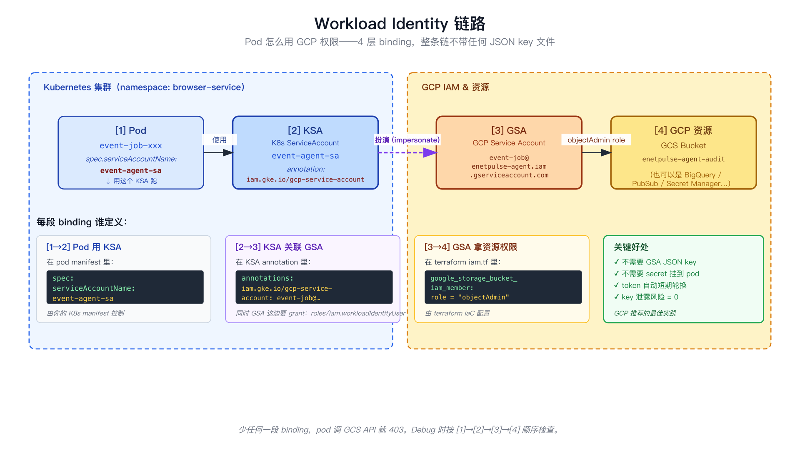

# 第 07 章：GKE — 存储与 IAM（storage.tf + iam.tf）

> 上一章：[06 — Autopilot 集群](06-gke-cluster.html) · [章节索引](./)

集群有了，要给它配套的存储和权限。这章看两个文件：

- `storage.tf` —— GCS bucket
- `iam.tf` —— Service Account + Workload Identity 绑定 + bucket 权限


*图：Workload Identity 链路：Pod → KSA → GSA → 资源，整链不带 JSON key*

## 1. storage.tf — GCS bucket

```hcl
resource "google_storage_bucket" "websites" {
  name                        = "${var.project_id}-${var.websites_bucket_suffix}"
  location                    = var.region
  uniform_bucket_level_access = true
  force_destroy               = true

  versioning {
    enabled = true
  }

  lifecycle_rule {
    action { type = "Delete" }
    condition {
      num_newer_versions = 5
      with_state         = "ARCHIVED"
    }
  }
}

resource "google_storage_bucket" "audit" {
  name                        = "${var.project_id}-${var.audit_bucket_suffix}"
  location                    = var.region
  uniform_bucket_level_access = true
  force_destroy               = true

  lifecycle_rule {
    action { type = "Delete" }
    condition {
      age = 90
    }
  }
}
```

### 1.1 第一个 bucket：websites

```hcl
resource "google_storage_bucket" "websites" {
  name = "${var.project_id}-${var.websites_bucket_suffix}"
  # 渲染成: "my-cloud-project-websites-data"
```

bucket name **全球唯一** —— 所以拼了 `project_id` 前缀避免撞名。

```hcl
  location = var.region
```

bucket 在哪个区域。GCS 有多种 location 类型：

- **region**（如 `europe-west3`）—— 单区域，便宜
- **multi-region**（如 `EU`、`US`）—— 多区域冗余，贵但可用性高
- **dual-region**（如 `eur4` = belgium+netherlands）—— 两个特定区域

我们用单区域，跟集群同 region 减少跨区流量费。

```hcl
  uniform_bucket_level_access = true
```

启用统一 IAM 模型（推荐）。关掉的话同时支持 ACL（旧式权限），管理混乱。

```hcl
  force_destroy = true
```

`terraform destroy` 时允许销毁带数据的 bucket（默认 `false`，会保护防误删）。Sandbox 用 `true`，**生产应改 `false`**。

### 1.2 versioning 与 lifecycle

```hcl
  versioning {
    enabled = true
  }
```

打开**对象版本控制** —— 同名文件覆写时保留旧版本（有点像 git）。给"误删保护"用。

```hcl
  lifecycle_rule {
    action { type = "Delete" }
    condition {
      num_newer_versions = 5
      with_state         = "ARCHIVED"
    }
  }
}
```

生命周期规则：**已归档的旧版本如果同名新版本超过 5 个就删**。避免无限堆积。

### 1.3 第二个 bucket：audit

```hcl
resource "google_storage_bucket" "audit" {
  ...
  lifecycle_rule {
    action { type = "Delete" }
    condition {
      age = 90
    }
  }
}
```

跟 websites 类似，但生命周期规则是**90 天后自动删**。审计数据保留 3 个月，符合大多数合规要求。

### 1.4 lifecycle_rule 能干什么

| action.type | 干啥 |
|---|---|
| `Delete` | 直接删 |
| `SetStorageClass` | 转存储类（如热 → 冷，便宜但读慢） |

`condition` 字段（任一满足即触发）：

- `age` —— 多少天后
- `num_newer_versions` —— 该对象有多少更新版本之后
- `with_state` —— `LIVE`（当前版本） / `ARCHIVED`（历史版本）
- `matches_prefix` / `matches_suffix` —— 文件名匹配
- `created_before` —— 时间戳

## 2. iam.tf — Service Account + 权限

```hcl
# 创建 Service Account
resource "google_service_account" "event_job" {
  account_id   = "event-job"
  display_name = "GSA: Event Job (single-step scraping)"
}

# 绑定 Workload Identity（让 K8s ServiceAccount 能"扮演"这个 GSA）
resource "google_service_account_iam_member" "event_job_wi" {
  service_account_id = google_service_account.event_job.id
  role               = "roles/iam.workloadIdentityUser"
  member             = "serviceAccount:${var.project_id}.svc.id.goog[browser-service/event-agent-sa]"
}

# 给 GSA 在 audit bucket 上 objectAdmin 权限
resource "google_storage_bucket_iam_member" "audit_writer_event" {
  bucket = google_storage_bucket.audit.name
  role   = "roles/storage.objectAdmin"
  member = "serviceAccount:${google_service_account.event_job.email}"
}
```

三个 resource 一起读，是一条完整的"pod 写 bucket"权限链路。

### 2.1 Service Account（GSA）= GCP 这边的"权限主体"

```hcl
resource "google_service_account" "event_job" {
  account_id   = "event-job"
  display_name = "GSA: Event Job (single-step scraping)"
}
```

**GSA = Google Service Account**。可以理解为"一个能访问 GCP 资源的虚拟机器人账号"。

- `account_id = "event-job"` 决定了它的邮箱：`event-job@my-cloud-project.iam.gserviceaccount.com`
- `display_name` 是 Console 里看的友好名字

GSA 创建后**默认啥权限都没有**。下面两个 resource 给它配权限。

### 2.2 Workload Identity 绑定 = 给 K8s pod 配 GCP 权限

```hcl
resource "google_service_account_iam_member" "event_job_wi" {
  service_account_id = google_service_account.event_job.id
  role               = "roles/iam.workloadIdentityUser"
  member             = "serviceAccount:${var.project_id}.svc.id.goog[browser-service/event-agent-sa]"
}
```

读法：**"让 K8s ServiceAccount `browser-service/event-agent-sa` 能扮演（impersonate）GSA `event-job`"**。

- `member` 的格式 `serviceAccount:{project}.svc.id.goog[{namespace}/{ksa-name}]` 是 Workload Identity 专用语法
- `roles/iam.workloadIdentityUser` 是允许"扮演"的权限

**结果**：你的 pod 用 `event-agent-sa` 这个 K8s ServiceAccount 启动后，自动获得 `event-job` GSA 在 GCP 上的所有权限 —— 但**整个过程不需要 JSON key 文件**，纯短期 token。

> 这就是为什么 GKE pod 不需要在镜像里塞 GCP credentials JSON。Workload Identity 替你在后台用 OIDC 换 token。

### 2.3 GSA 拿到的实际权限

```hcl
resource "google_storage_bucket_iam_member" "audit_writer_event" {
  bucket = google_storage_bucket.audit.name
  role   = "roles/storage.objectAdmin"
  member = "serviceAccount:${google_service_account.event_job.email}"
}
```

这才是给 GSA "实际能干啥"的权限：

- 在 `my-cloud-project-audit` bucket 上有 `storage.objectAdmin` 权限
- `objectAdmin` 包含 read / write / delete 对象 —— 比 `objectViewer` 强，比 `admin` 弱（不能改 bucket 配置）

### 2.4 串起来：pod 写 audit 的链路

```
Pod 用 K8s ServiceAccount: browser-service/event-agent-sa
    ↓ Workload Identity binding (workload_identity_config + iam_member)
GSA: event-job@my-cloud-project.iam.gserviceaccount.com
    ↓ storage.objectAdmin role on audit bucket
GCS bucket: my-cloud-project-audit
    ↓ 写
gs://my-cloud-project-audit/multi-step/{site}/{sport}-{key8}/{date}/scheduled.json
```

**每个箭头都是一个 IAM 检查点**。少一个绑定，整条链路就断 —— pod 会拿到 403 / 401。

常见 debug 流程：

1. Pod 报 `403 Forbidden` 写 GCS
2. 先看 K8s 这边：pod spec 是不是用的 `event-agent-sa`？K8s ServiceAccount 是不是有 `iam.gke.io/gcp-service-account` annotation 指向 GSA？
3. 再看 GCP 这边：GSA 是不是有 `iam.workloadIdentityUser` 给那个 K8s SA？GSA 是不是有 `storage.objectAdmin` 在那个 bucket 上？

少哪个补哪个。

## 3. 这两个文件你能改什么

| 想改的 | 改哪里 |
|---|---|
| 加一个新 bucket | 复制一个 `google_storage_bucket` 块 |
| 改 audit 保留期 | `condition.age = 180` |
| 加一个新 GSA（如新工作负载） | 复制一个 `google_service_account` + 对应的两个 `iam_member` |
| 给现有 GSA 加新 bucket 权限 | 加一个 `google_storage_bucket_iam_member` 块 |
| 收紧权限（如 viewer 而非 admin） | 改 `role = "roles/storage.objectViewer"` |
| 改 K8s ServiceAccount 名字 | 改 `member` 里 `[browser-service/event-agent-sa]` 的 SA 名 |

## 4. 一个常见坑：iam_member vs iam_binding vs iam_policy

GCP IAM 在 Terraform 里有 **3 个看似相似但完全不同**的 resource 类型：

| Resource | 行为 | 风险 |
|---|---|---|
| `*_iam_member` | **追加**一条 (member, role) | 🟢 安全 —— 不动别人 |
| `*_iam_binding` | **覆盖整个 role 的所有 members** | 🟡 危险 —— 会清掉你不知道的 member |
| `*_iam_policy` | **覆盖整个资源的所有 IAM 策略** | 🔴 极危 —— 一不小心把别人配的全抹了 |

**永远用 `_iam_member`**，除非你有明确理由要"独占管理"。本项目全用 `_iam_member`。

## 5. 学完这一章应该会什么

- ✅ 知道 GCS bucket 的 `versioning` + `lifecycle_rule` 怎么用
- ✅ 知道 GSA（Google Service Account）≠ KSA（Kubernetes ServiceAccount）
- ✅ 看 Workload Identity 绑定能 traceback 出"哪个 pod 能干啥"
- ✅ 理解 IAM 权限链路：3 个箭头都得通
- ✅ 知道 `_iam_member` vs `_iam_binding` vs `_iam_policy` 的差别 —— 实际用第一个

---

> 下一章：[07b — 镜像仓库（Artifact Registry）](07b-gke-artifact-registry.html) · [章节索引](./)
